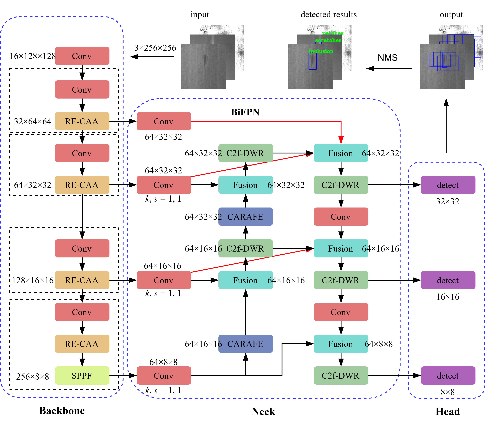
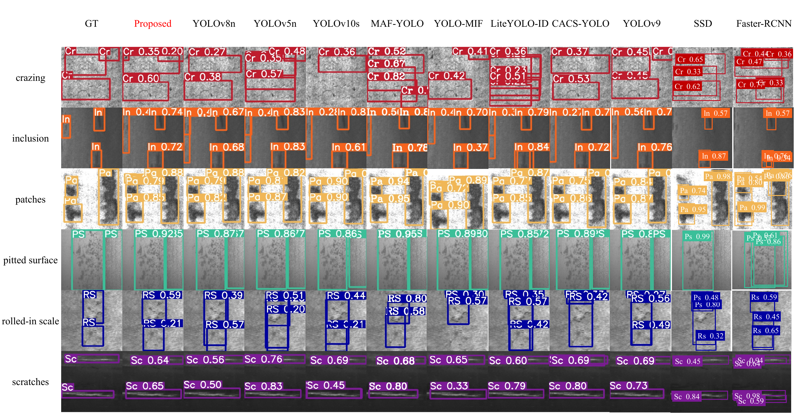

# A Fast Steel Surface Defect Inspection Approach using Contextual Anchor Attention and Bidirectional Feature Pyramid Fusion Network

By Guizhong Fu, Wenwu Le, Qixin Zhu, Jingbin Li, Quansheng Jiang and Yehu Shen.


The paper is available at [`[PDF Download]`](https://iopscience.iop.org/article/10.1088/1361-6501/adc9d7)


### Abstract
In recent years, intelligent object detection technology has been applied to many industries. 
However, the high leakage rate of multiple defects and inefficient detection speed hinders the application of intelligent technology in steel surface defect detection tasks. 
Therefore, this paper proposes the RCD-YOLO model for solving the above problems. 
In the model backbone, the RE-CAA module is designed to extract defect features, and the attention mechanism helps capture defect features. 
In the model neck, the CARAFE lightweight up-sampling operator is used to improve the ability to retain effective features when the feature scale varies; 
the C2f-DWR feature extraction method and BiFPN multiscale feature fusion architecture are designed in the multiscale feature fusion process. 
In this paper, experiments are carried out on the NEU-DET dataset, and the experimental results show that the proposed RCD-YOLO model can achieve 80.3\% mAP, of which the crazing type achieves 65.9\% mAP. 
The model achieves high precision and still maintains high reasoning speed at 178 FPS, which fully meets the real-time manufacture requirement, indicating that the present scheme has a good application prospect in practical production.






### Cite us using:
```bibtex
@article{10.1088/1361-6501/adc9d7,
	author={Fu, Guizhong and Le, Wenwu and Zhu, Qixin and Li, Jingbin and Jiang, Quansheng and Shen, Yehu},
	title={A Fast Steel Surface Defect Inspection Approach using Contextual Anchor Attention and Bidirectional Feature Pyramid Fusion Network},
	journal={Measurement Science and Technology},
	url={http://iopscience.iop.org/article/10.1088/1361-6501/adc9d7},
	year={2025},
}
```


### Contact
If you have any questions, feel free to contact:
- Guizhong Fu (fuguizhongchina@163.com)
